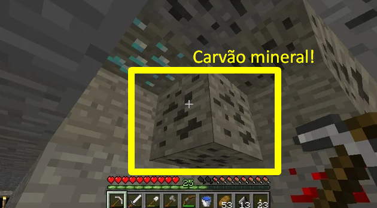
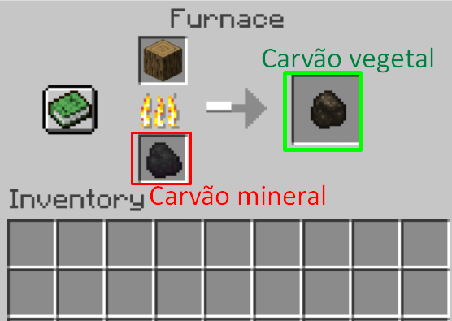
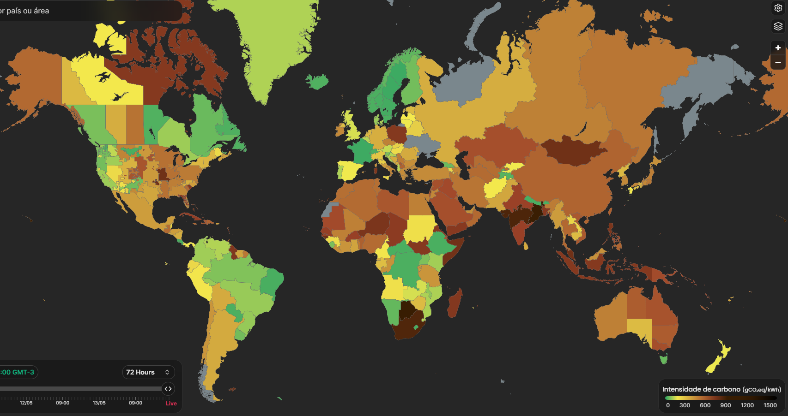

<h1>⚫ O que é o Carvão?</h1>

Existem dois tipos principais de carvão: o <strong>carvão vegetal</strong> e o <strong>carvão mineral</strong>. Eles são diferentes na forma como são feitos e usados.

  

    
    
<strong>Carvão Mineral</strong> Retirado do subsolo, usado para gerar energia

  

  

    
    
<strong>Carvão Mineral</strong> O carvão vegetal é produzido a partir de madeira

  

 

<h2>🔥 Mas tem um problema...</h2>

Quando o carvão é queimado para fazer energia, ele solta muita fumaça no ar. Essa fumaça tem um gás chamado <strong>gás carbônico (CO2)</strong>, que deixa o planeta mais quente. Atualmente, o carvão mineral representa cerca de 1,75% da matriz elétrica brasileira, conforme dados da Agência Nacional de Energia Elétrica (ANEEL). Nesse mapa podemos ver que o Brasil está muito bem comparado aos outros países a questão de emisão de gás carbônico!

  
  
🌍 Quanto mais CO2, mais quente fica o planeta!

O carvão é o combustível que mais polui o ar entre os fósseis. Ele solta mais CO2 do que:

<ul>
  <li>🌬️ Gás natural</li>
  <li>🚗 Gasolina</li>
  <li>🛢️ Petróleo</li>
</ul>

Por isso, muitos países estão tentando usar menos carvão e mais energias limpas, como o sol 🌞 e o vento 💨.

<h2>🎥 Vídeo: Carvão e Meio Ambiente</h2>

Veja neste vídeo curiosidades sobre o carvão:

<iframe 
    width="100%" 
    height="400" 
    src="https://www.youtube.com/embed/ky1YTspbvw8" 
    title="CURIOSIDADES SOBRE O CARVÃO MINERAL" 
    frameborder="0" 
    allow="accelerometer; autoplay; clipboard-write; encrypted-media; gyroscope; picture-in-picture" 
    allowfullscreen>
</iframe>

<h2>🗺️ Onde estão as usinas de carvão no mundo?</h2>

Este mapa mostra onde existem usinas de carvão pelo planeta. Clique no botão para explorar!

<a href="https://globalenergymonitor.org/pt/projects/global-coal-plant-tracker/tracker/" target="_blank" rel="noopener noreferrer" style="display:inline-block; padding: 12px 20px; background-color:#333; color:white; text-decoration:none; border-radius:8px;">🌍 Ver Mapa Global das Usinas de Carvão</a>

