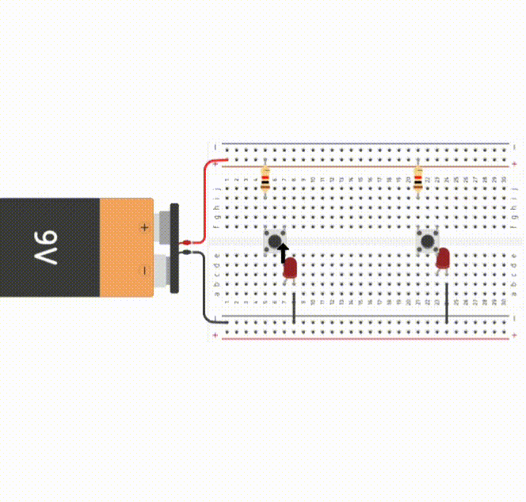

# 🧪 Explorando Circuitos com Capacitores!

## 📌 Antes de tudo: como funciona uma protoboard?

A protoboard é como um tabuleiro onde podemos conectar os componentes eletrônicos sem precisar soldar nada!

- Os **furos em linha horizontal** nas bordas são usados pra ligar a energia (positiva e negativa).
- Os **furos em linha vertical** no meio conectam os componentes entre si.
- Isso ajuda a gente a montar circuitos de forma fácil e organizada!

---
## ⚡ Descobrindo os Circuitos Elétricos!

Antes de aprender sobre peças mais "elétricas e misteriosas", como os capacitores, vamos começar vendo **como a corrente elétrica funciona** num circuito simples. E pra isso, nada melhor que **luz e botões**!

---

### 🔴🟢 Dois LEDs e Dois Botões – Quem acende o quê?

Nesse primeiro circuito, temos **dois botões** e **dois LEDs**. Cada botão controla um LED diferente.

🛠️ Quando você **aperta o botão vermelho**, o LED vermelho acende.  
🛠️ Quando aperta o **botão verde**, o LED verde acende.

E tem mais: se você apertar os **dois botões ao mesmo tempo**, os **dois LEDs acendem juntos**!

🧠 O que isso nos ensina?
- A **corrente elétrica só flui** quando existe um **caminho completo**.
- O botão funciona como um **interruptor**: se ele está aberto, a corrente não passa; se está fechado, a corrente flui.
- O LED mostra se a corrente está ou não passando, porque ele só acende quando recebe energia.

🎬 **Veja no vídeo como funciona esse circuito:**  

---

## ⚙️ Agora, uma coisinha mais elaborada...

Já que você entendeu como **acender LEDs com botões**, vamos ver um circuito um pouco mais esperto!

Apresentamos agora um circuito com uma peça diferente: o **capacitor**.

---

## 🔋 O que é um capacitor?

Imagine um copo d'água que vai enchendo devagar... Um **capacitor** faz algo parecido, mas com **energia elétrica**!

- Ele **armazena carga elétrica** e pode **liberar essa energia depois**.
- Serve para **controlar o tempo** em que a energia circula no circuito.
- É muito usado em **temporizadores**, **filtros** e até em **flash de câmera!**

---

## 🔄 Circuito RC em Série

Nesse tipo de circuito, o **resistor** e o **capacitor** estão conectados um **depois do outro**, como se estivessem fazendo fila.

### O que acontece aqui?

- Quando ligamos o circuito, o capacitor começa a **carregar** aos poucos.
- O LED vai **acendendo devagar**, porque a corrente passa lentamente enquanto o capacitor enche.
- Depois de um tempo, o capacitor se enche e o LED acende totalmente (ou para de acender se estiver após o capacitor).

---

## 🧪 Desafio pra você!

👩‍🔬 Experimente trocar os valores do resistor e do capacitor e veja como isso muda o tempo que o LED leva pra acender ou apagar.

🧑‍🔬 Quanto **maior o capacitor**, mais energia ele guarda. E quanto **maior o resistor**, mais devagar ele deixa a energia passar.

---

✨ Legal, né? Agora é sua vez de brincar com a protoboard e ver tudo isso na prática!
- Pode usar um site de simulação como os usados para gerar os gifs de capacitores dessa aula: https://www.tinkercad.com
