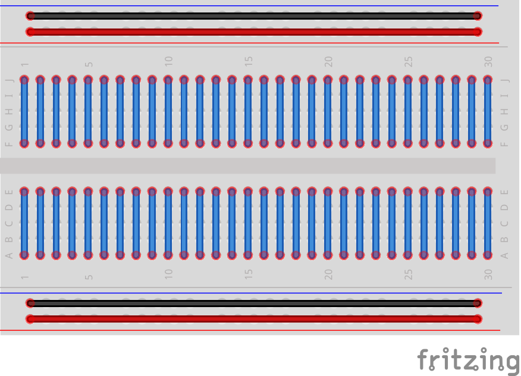
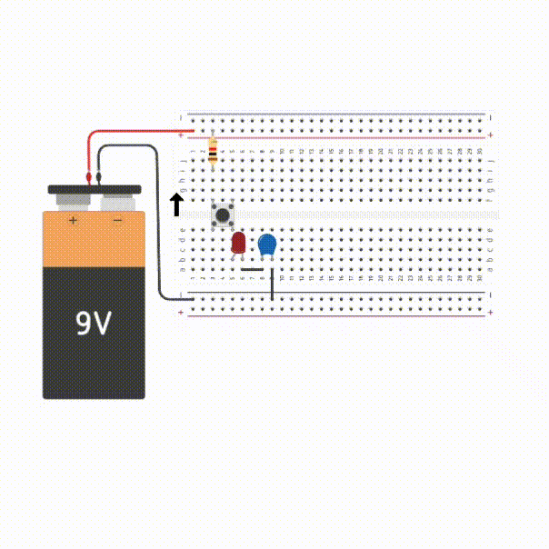

# 🧪 Explorando Circuitos com Capacitores!

## 📌 Antes de tudo: como funciona uma protoboard?

A protoboard é como um tabuleiro onde podemos conectar os componentes eletrônicos sem precisar soldar nada!

- Os **furos em linha horizontal** nas bordas são usados pra ligar a energia (positiva e negativa).
- Os **furos em linha vertical** no meio conectam os componentes entre si.
- Isso ajuda a gente a montar circuitos de forma fácil e organizada!

---

## 🔋 O que é um capacitor?

Imagine um copo d'água que vai enchendo devagar... Um **capacitor** faz algo parecido, mas com **energia elétrica**!

- Ele **armazena carga elétrica** e pode **liberar essa energia depois**.
- Serve para **controlar o tempo** em que a energia circula no circuito.
- É muito usado em **temporizadores**, **filtros** e até em **flash de câmera!**

---

## 🔄 Circuito RC em Série

Nesse tipo de circuito, o **resistor** e o **capacitor** estão conectados um **depois do outro**, como se estivessem fazendo fila.

### O que acontece aqui?

- Quando ligamos o circuito, o capacitor começa a **carregar** aos poucos.
- O LED vai **acendendo devagar**, porque a corrente passa lentamente enquanto o capacitor enche.
- Depois de um tempo, o capacitor se enche e o LED acende totalmente (ou para de acender se estiver após o capacitor).

---

## 🔁 Circuito RC em Paralelo

Aqui o capacitor está em **paralelo com o LED**, como se os dois tivessem caminhos diferentes ligados na mesma fonte de energia.

### O que acontece aqui?

- Quando ligamos o circuito, o LED acende **normalmente**, enquanto o capacitor também começa a carregar.
- **Ao desligar**, o capacitor libera sua energia pelo LED.
- O LED então **vai apagando devagar**, como um fade-out, enquanto o capacitor descarrega.

---

## 🧠 Resumindo:

- **RC em Série**: o capacitor **carrega devagar**, o LED **acende lentamente**.
- **RC em Paralelo**: o capacitor **descarga devagar**, o LED **apaga lentamente**.

---

## 🧪 Desafio pra você!

👩‍🔬 Experimente trocar os valores do resistor e do capacitor e veja como isso muda o tempo que o LED leva pra acender ou apagar.

🧑‍🔬 Quanto **maior o capacitor**, mais energia ele guarda. E quanto **maior o resistor**, mais devagar ele deixa a energia passar.

---

✨ Legal, né? Agora é sua vez de brincar com a protoboard e ver tudo isso na prática!
- Pode usar um site de simulação como os usados para gerar os gifs de capacitores dessa aula: https://www.tinkercad.com
