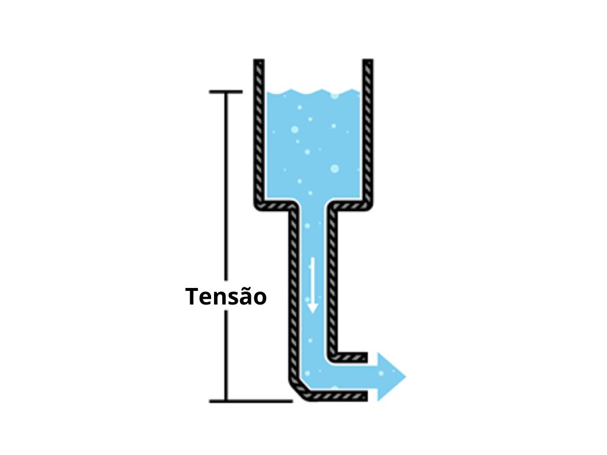
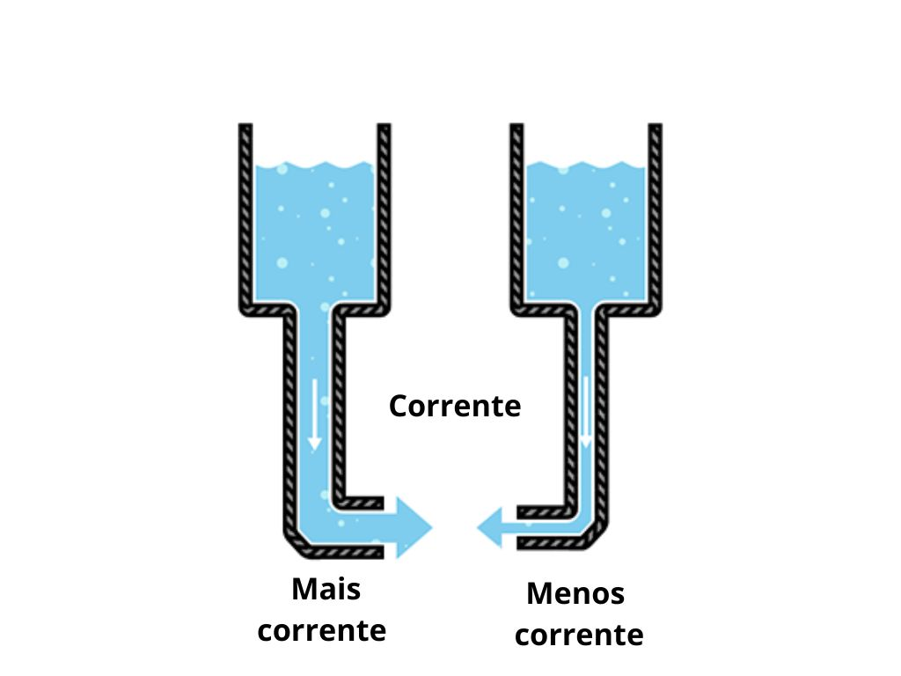
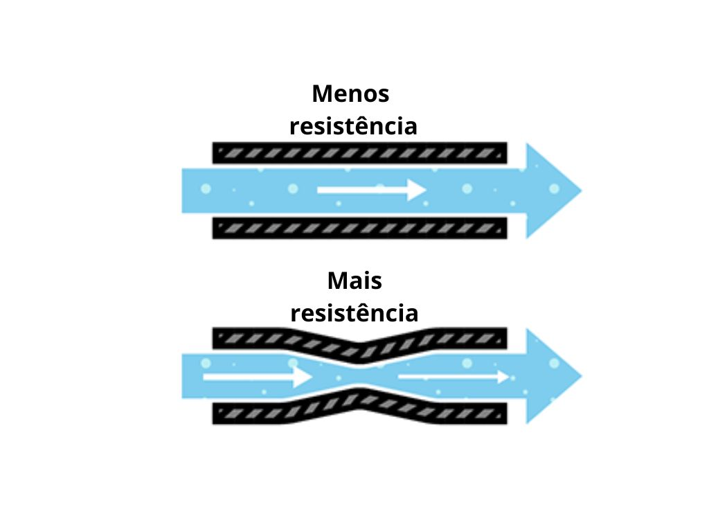

### ⚡ Tensão (ou Voltagem)

Imagina uma **caixa d'água bem alta** conectada a um cano.

A **tensão elétrica** é como a **pressão da água** nesse cano.  
Quanto mais alta a caixa d'água, maior a pressão.  
Na eletricidade, quanto maior a tensão, maior a **força que empurra os elétrons** no fio.

> 💬 **Tensão é o que faz as cargas se moverem!**

#### 🔍 Um exemplo:

Se você tiver uma caixa d'água no chão, a água nem vai sair com força.  
Agora, se colocar ela lá no alto de uma torre… a pressão vai ser grande!

É a mesma ideia com **pilhas ou tomadas**:  
- Uma pilha comum tem 1,5 volts.  
- Uma tomada no Brasil, geralmente, tem **127V ou 220V**.

---

### 🔁 Corrente Elétrica

Seguindo nossa analogia da água:

A **corrente elétrica** é como o **fluxo da água correndo pelo cano**.

> 💬 Corrente é o quanto de **carga elétrica** passa por um ponto do fio **a cada segundo**.

Se abrirmos a torneira da caixa d’água, a água começa a fluir.  
Na eletricidade, quando há tensão, os elétrons começam a "fluir" pelo fio.  
Isso é a **corrente**, medida em **ampères (A)**.
Repare que, nessa analogia, quanto maior o cano, mais flúido flui por ele, então maior a corrente.

---

### 🧱 Resistência Elétrica

Agora imagina que o cano tem pedras dentro, ou é muito estreito.  
A água ainda vai passar, mas com mais dificuldade.

A **resistência elétrica** é exatamente isso no mundo dos elétrons:  
> 💬 É tudo aquilo que dificulta a passagem da corrente elétrica.

Quanto **maior a resistência**, **menor é a corrente** (se a tensão for a mesma).  
É medida em **ohms (Ω)**.

#### 🧠 Exemplo:
- Fios de cobre têm **baixa resistência** (a corrente passa fácil).
- Borracha tem **alta resistência** (quase nada passa).

