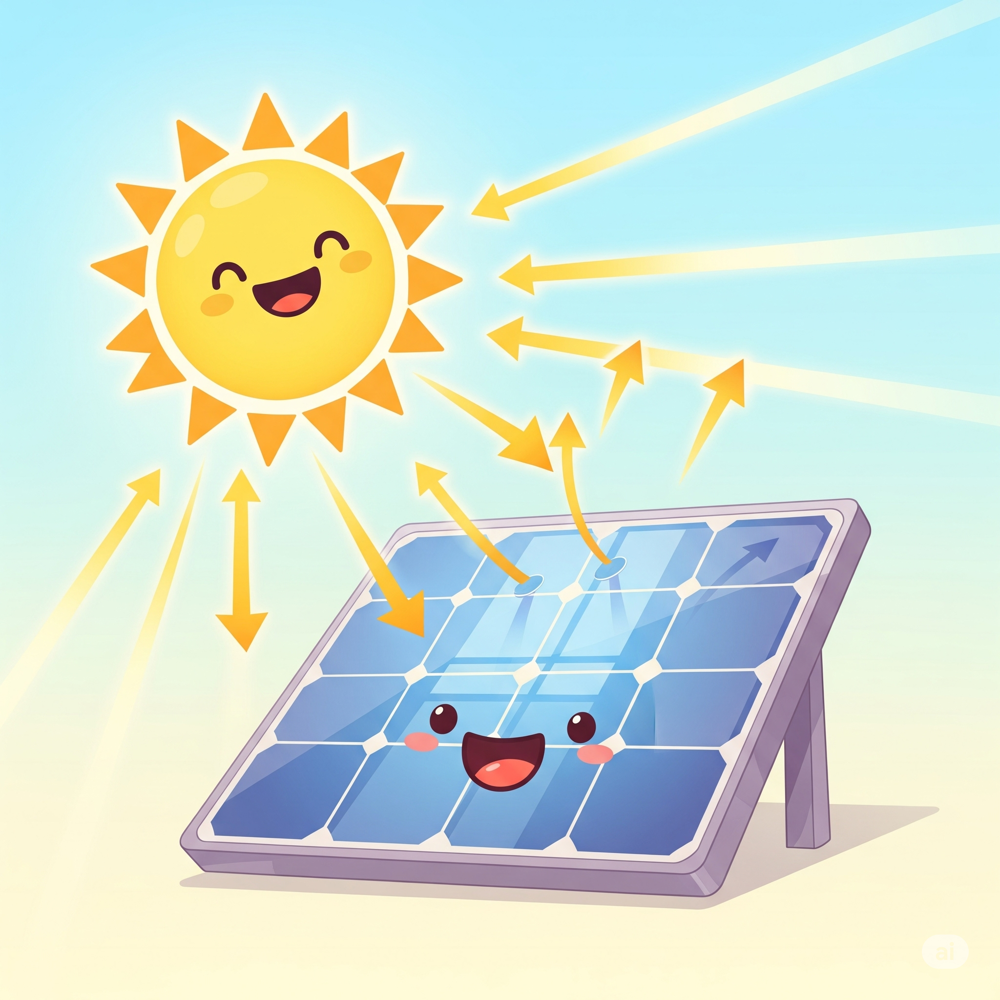

# ⚡ Eficiência Real de Geradores de Energia

Agora que você já sabe o que é eficiência, vamos ver como isso se aplica de verdade às **máquinas que geram energia elétrica**!

---

## 🏭 Toda Máquina Tem Suas Perdas

Nenhuma máquina consegue transformar **toda** a energia de entrada em eletricidade.  
Vamos dar uma olhada em alguns tipos de geradores e **quanta energia eles realmente aproveitam**.

---

## 🌞 Painel Solar

- **Entrada**: Luz do Sol
- **Saída**: Energia elétrica

🔋 **Eficiência típica**: **15% a 22%**

> A maior parte da luz do Sol vira calor ou é refletida. Só uma parte se transforma em eletricidade

---

## 💨 Turbina Eólica

- **Entrada**: Vento
- **Saída**: Energia elétrica

🔋 **Eficiência típica**: **35% a 45%**

> O vento gira as hélices, mas nem toda essa força pode ser aproveitada. Parte se perde com atrito, turbulência e limitações da própria hélice.

---

## 💧 Usina Hidrelétrica

- **Entrada**: Água em movimento
- **Saída**: Energia elétrica

🔋 **Eficiência típica**: **80% a 90%**

> A força da água é muito aproveitável! Por isso, usinas hidrelétricas costumam ser mais eficientes que painéis solares ou turbinas eólicas.

---

## 🔥 Usinas Termelétricas

- **Entrada**: Queima de carvão, gás ou óleo
- **Saída**: Energia elétrica

🔋 **Eficiência típica**: **33% a 40%**

> Muita energia se perde em forma de calor no processo de aquecer a água e gerar vapor.

---

## 🧊 E a Gente Perde Energia Até Nos Fios!

Mesmo **depois** que a energia é gerada, parte dela se perde no caminho até as casas, por causa do **aquecimento dos fios**!

📉 Isso também diminui a eficiência **total** do sistema de geração e distribuição de energia.

---

## 🧠 Comparando as Eficiências

| Tipo de Geração     | Eficiência Média |
|---------------------|------------------|
| Hidrelétrica         | ✅ 80–90%        |
| Eólica               | ⚠️ 35–45%        |
| Termelétrica         | ❌ 33–40%        |
| Painel Solar         | ❌ 15–22%        |

> Nem sempre o mais eficiente é o mais sustentável. E nem sempre o mais sustentável é o mais eficiente. É preciso **equilibrar** as coisas! 🌍

---

## 🌟 Uma Importante Conclusão

Mesmo que algumas fontes de energia pareçam "fracas", elas são importantes porque são **renováveis** ou **limpas**.

O desafio é tornar essas fontes **mais eficientes** para que a gente possa usar menos recursos e poluir menos o planeta. 🌱✨

🚀
