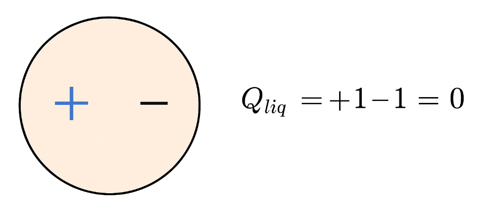
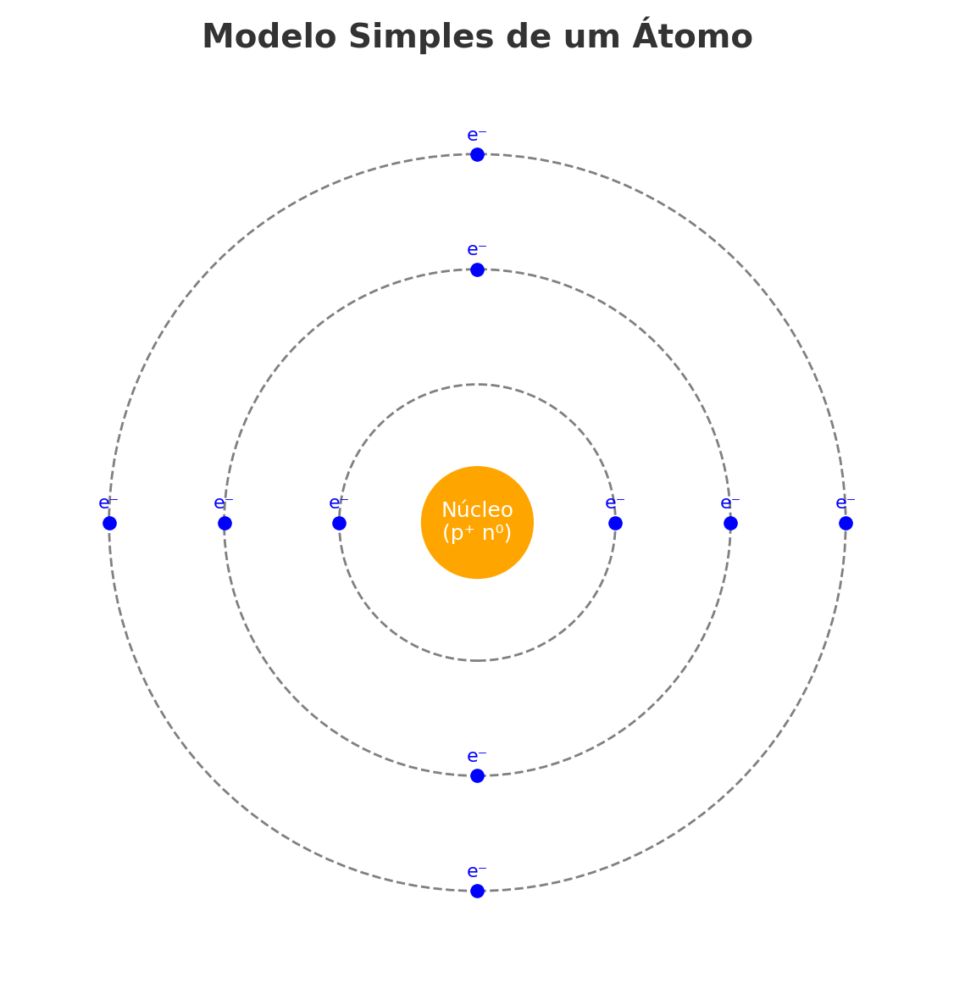

# O que é eletricidade?:

Eletricidade é como nos referimos ao comportamento de **cargas elétricas**, como elas se movimentam e interagem entre si! 

A eletricidade é a principal forma de energia utilizável que temos acesso. Por exemplo, no nosso dia-a-dia, podemos utilizar a energia elétrica fornecida pela concessionária da região, que chega até as nossas casas e escolas, energizando as tomadas e assim possibilitando que liguemos diversos equipamentos como lâmpadas, geladeiras, computadores, fornos elétricos etc.

### Cargas elétricas:

Para entender como funciona a eletricidade, precisamos compreender primeiramente a pergunta "o que são as cargas elétricas?". Na natureza existem 2 tipos de cargas: as **positivas (+)** e as **negativas (-)**. 

 - Corpos com números iguais de cargas positivas e negativas são chamados de corpos **eletricamente neutros** e tem **carga total** igual a 0.

 - A unidade de carga elétrica no sistema internacional de unidades é o **Coulomb (C)**.

 - A **carga total** é a soma de cargas em um corpo. 

Vamos supor que tenhamos a esfera abaixo com uma carga positiva +1 e uma carga negativa -1. A carga total pode ser calculada pela soma das cargas, assim $$Q_{liq} = +1 -1 = 0$$. Assim podemos dizer que essa esfera é eletricamente neutra. 

 - Corpos com mais cargas positivas que cargas negativas, são corpos **eletricamente positivos** e tem carga total maior que 0.
   
 - De maneira similar, corpos com mais cargas negativas que cargas positivas são corpos **eletricamente negativos** e tem carga total menor que 0. 

 - Cargas positivas e negativas se atraem, enquanto cargas de mesma natureza se repelem. 

Essa atração e repulsão acontecem pela chamada **lei de Coulomb**! Essa lei é uma equação matemática que permite que engenheiros e cientistas calculem a força de atração ou repulsão sofrida por duas cargas pela distância entre elas e o valor dessas cargas. Não se assuste! Vamos entender como ela funciona.

#### Lei de Coulomb:

$$F = k \cdot \frac{|q_1 \cdot q_2|}{r^2}$$

#### ⚡ Observações:
Essa equação muito doida diz para nós basicamente que:

- A força é **atrativa** se as cargas forem **opostas** (positivo e negativo).
- A força é **repulsiva** se as cargas forem **de mesma natureza** (positivo e positivo ou negativo e negativo).

Confira a simulação abaixo para ver a Lei de Coulomb em ação. Clique em escala macro, mova o boneco, altere entre cargas positivas e negativas e veja a força elétrica mudando!

<iframe src="https://phet.colorado.edu/sims/html/coulombs-law/latest/coulombs-law_all.html?locale=pt_BR" width="100%" height="500px"></iframe>

Reparou que quando colocamos uma carga positiva e a outra negativa, os bonecos precisam puxar as cargas para elas ficarem paradas? Isso é porque elas se **atraem** uma em direção a outra.

Quando colocamos cargas com sinais iguais, os bonecos começam a empurrar as cargas. Isso é porque as cargas se **repelem**!

Tudo bem, falamos sobre a existência desses dois tipos de carga, mas essa ainda não é uma resposta completa para a pergunta que nos fizemos. Talvez uma melhor pergunta para entendermos o que são as cargas elétricas seja nos perguntar "de onde essas cargas vem?". A resposta para essa pergunta está nos átomos!

---

### Os átomos:

Os **átomos** são unidades fundamentais de formação da matéria e são compostos por 3 partículas fundamentais: os **prótons**, **neutrons** e **elétrons**. 

 - **Prótons** são partículas com carga positiva $$+e$$, onde $$e$$ é o que nós chamamos de **carga elementar**. Prótons tem massa $$ m \approx 1 u $$, onde $$u$$ é a unidade fundamental de massa atômica. 

 - Os **neutrons** são partículas eletricamente neutras e tem aproximadamente a mesma massa do próton. 

 - Já os **elétrons** tem carga negativa $$-e$$ e massa aproximada de $$\frac{1u}{1836}$$. 

Repare que os prótons e elétrons tem a mesma carga, com sinal trocado. Em muitos cálculos de massa atômica, muito utilizados na química e na física, desconsideramos a massa dos elétrons uma vez que ela é muito muito muito baixa. 

Além disso, os átomos tem 2 regiões principais: o **núcleo** e a **eletrosfera**. 

 - O **núcleo** dos átomos é **eletricamente positivo**, é onde se concentram um ou mais prótons e pode ou não possuir neutrons também. O número de prótons no núcleo define qual elemento da tabela periódica aquele átomo representa.

 - A **eletrosfera** é a região em volta do núcleo atômico onde habitam os elétrons.

Quando um átomo tem o mesmo número de prótons e elétrons, como vimos anteriormente, ele é eletricamente neutro, pois apresenta carga total nula. Quando um átomo tem números diferentes de prótons e elétrons, ele pode ser eletricamente positivo ou negativo e passa a ser um **íon**.

Para ter um número diferente de elétrons e prótons e se tornar um íon, um átomo deve perder ou ganhar elétrons. 

- Quando um átomo ganha um ou mais elétrons, ele passa a ter carga total negativa, pois tem mais cargas negativas que cargas positivas. Íons com carga negativa são chamados de **ânions**.

- Agora, quando um átomo perde elétrons, ele passa a ter carga total positiva, pois tem mais cargas positivas que cargas negativas. Íons com carga positiva são chamados de **cátions**.

Vamos ver a física atômica em ação! Lembre-se do que falamos, clique no botão "ÁTOMO" e monte um átomo (ou um íon) na simulação abaixo! No lado direito da tela veja qual átomo da tabela periódica você montou.

<iframe src="https://phet.colorado.edu/sims/html/build-an-atom/latest/build-an-atom_all.html?locale=pt_BR" width="100%" height="500px"></iframe>

---
