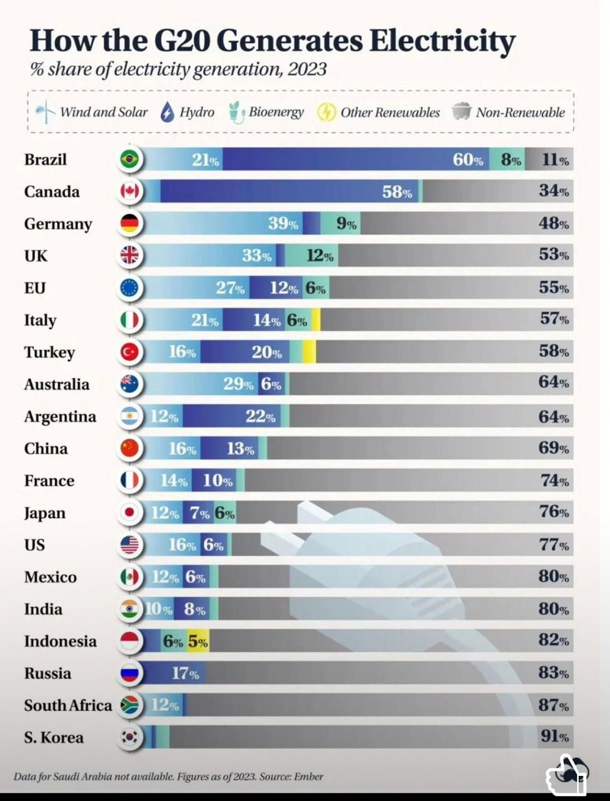

## **🟢🟡Panomara Geral do BRASIL**

## **1. Matriz Energética Nacional (Oferta Interna de Energia - OIE)**

Renovabilidade: A matriz energética brasileira atingiu 50% de renovabilidade em 2024.
Fontes que se destacaram: Crescimento de gás natural, eólica e solar.
Oferta Interna de Energia (OIE): Atingiu 322 Mtep (milhões de toneladas equivalentes de petróleo), um aumento de 2,4% em relação ao ano anterior.

## **2. Matriz Elétrica Nacional (Geração Elétrica e Capacidade Instalada)**

Renovabilidade na Matriz Elétrica: O Brasil alcançou 88,2% de participação de fontes renováveis em sua matriz elétrica em 2024. Este é o maior patamar de renováveis desde 1989.
Expansão Recorde: A matriz elétrica brasileira registrou a maior expansão da história em 2024, com um acréscimo de 10.853,35 MW (cerca de 10,9 GW) na capacidade de geração.
Destaque para Eólica e Solar: Juntas, as usinas eólicas e solares foram responsáveis por 24% da geração total de eletricidade em 2024.
A geração solar fotovoltaica (centralizada e micro/minigeração distribuída) atingiu 70,7 TWh e sua capacidade instalada alcançou 48.468 MW, um crescimento de 28,1% em relação ao ano anterior.
A geração eólica também teve um crescimento significativo, contribuindo para esse aumento da participação renovável.
Hidrelétricas: Continuam sendo a principal fonte, responsáveis por cerca de 61% de toda a energia consumida no país em 2024, um aumento de 1 ponto percentual em comparação com 2023.
Combustíveis Fósseis:
A participação das fontes fósseis na matriz elétrica foi de aproximadamente 11%.
O gás natural teve um crescimento de 2 pontos percentuais, passando de 5% para 7%.
O carvão reduziu sua participação pela metade, de 2% para 1%.
Biomassa: A geração térmica oriunda de biomassa representou 40,6% da geração térmica total em 2024.

Abaixo, você consegue vizualizar um gráfico de matriz energética dos países do G20 no ano de 2023, nele é perceptível que o Brasil se posiciona como o país que mais gera energia a partir de fontes renováveis(em porcentagem)!

  
  
🌍 Quanto mais CO2, mais quente fica o planeta!

O carvão é o combustível que mais polui o ar entre os fósseis. Ele solta mais CO2 do que:

