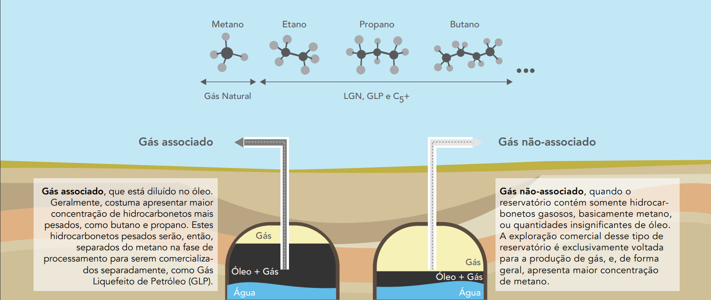

<h1>💨 O que é o Gás Natural?</h1>

O gás natural é uma mistura de gases que sai do subsolo, junto com o petróleo. Ele é usado para cozinhar, gerar eletricidade e até para mover veículos.

É considerado um combustível mais "limpo" do que o carvão e o petróleo, porque libera menos fumaça (CO2) quando é queimado. Mas mesmo assim, ainda polui o ar e pode causar problemas ao meio ambiente.

  
  
Fonte: FGV Cadernos 2014

<h2>🎥 Como o Gás Natural é usado?</h2>

Assista ao vídeo para entender melhor como funciona o ciclo do gás natural:

<iframe 
    width="100%" 
    height="400" 
    src="https://www.youtube.com/embed/iOoEA4nZa_0" 
    title="O Caminho do Gás Natural" 
    frameborder="0" 
    allow="accelerometer; autoplay; clipboard-write; encrypted-media; gyroscope; picture-in-picture" 
    allowfullscreen>
</iframe>

<h2>🌍 Mapa Mundial das Estruturas de Gás</h2>

Veja onde estão os dutos e infraestruturas de gás natural ao redor do mundo. É um mapa interativo super interessante!

<a href="https://globalenergymonitor.org/projects/global-gas-infrastructure-tracker/tracker/" target="_blank" rel="noopener noreferrer" style="display:inline-block; padding: 12px 20px; background-color:#007ACC; color:white; text-decoration:none; border-radius:8px;">🔠Ver Mapa Global de Gás Natural</a>

