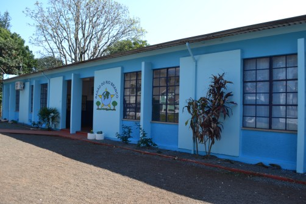

# Sobre

Este site foi criado para apoiar as aulas de Ciências, Geografia e Matemática dos alunos da **Escola Estadual de Ensino Fundamental Barão do Rio Branco**, localizada em Catuípe/RS.  

A iniciativa é fruto de uma parceria entre as professoras **Mari Rosso**, **Marla Tedeschi** e **Cristina Bottega** com estudantes da **Universidade de São Paulo (USP)**, dentro da disciplina **LOM3095: Tecnologias Limpas para Geração de Energia**, da Escola de Engenharia de Lorena (EEL-USP).  

Aqui você encontrará materiais de apoio, projetos, recursos interativos e conteúdos extras para tornar o aprendizado mais acessível, divertido e conectado com o dia a dia.  

Sintam-se em casa!

