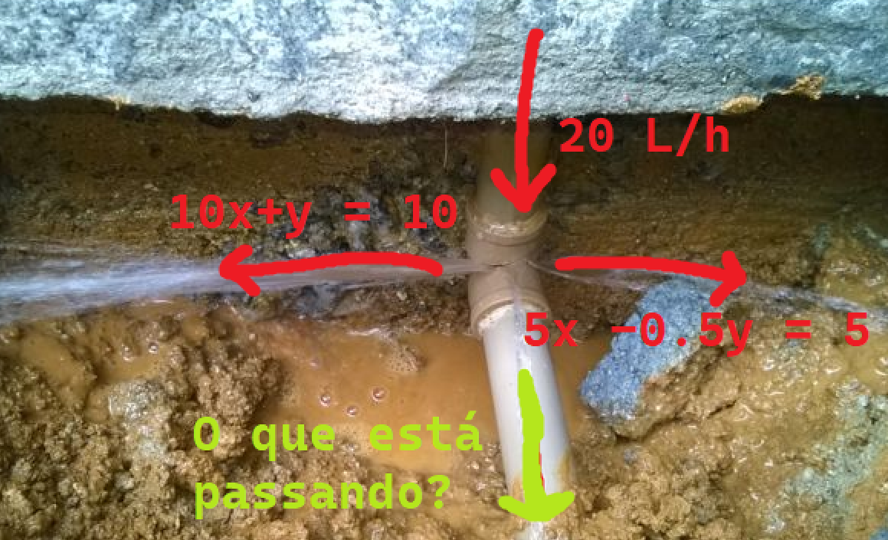

  
  
Equação representando um sistema elétrico (Ex: associação de resistores)

  
  
Equação representando fluxo de água em tubulações conectadas

  

    <iframe src="https://phet.colorado.edu/sims/html/equality-explorer-two-variables/latest/equality-explorer-two-variables_pt_BR.html" allowfullscreen></iframe>
  

  
Simulação interativa do PhET: Explorador de igualdade (2 variáveis)

  

    <iframe scrolling="no" title="Sistema linear de 2 equações com 2 incógnitas"
      src="https://www.geogebra.org/material/iframe/id/zkwnzsd8/width/929/height/500/border/888888/sfsb/true/smb/false/stb/false/stbh/false/ai/false/asb/false/sri/false/rc/false/ld/false/sdz/false/ctl/false">
    </iframe>
  

  
Visualização gráfica de sistemas lineares com 2 equações e 2 incógnitas (GeoGebra)

